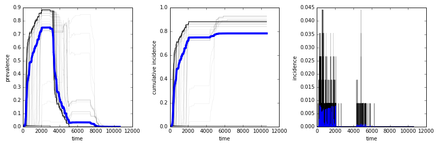

# TemporalNetworkEpidemics
We provide methods from linear algebra to simulate infection processes on time-varying topologies. For more information see reference  Koher, A. et a. [**Infections on Temporal Networks - A Matrix-Based Approach**](https://journals.plos.org/plosone/article?id=10.1371/journal.pone.0151209) , PLoS ONE **11**, 4, (2016)

# Epidemics on temporal networks
The code implements three widely used epidemic models for simulation on temporal networks (ref [1]): SI, SIR and SIS. Each node can be either susceptible (S), infected (I) or recovered with permanent immunity (R). Furthermore, the disease transmission happens with a given probability upon contact and the recovery time is fixed to a number of time steps.
The code comes with two data sets: A graph of sexual encounters and a face to face contacts network. The data has been downloaded from ref. [2] and ref. [3], respectively.
More information on the approach that has been implemented here, can be found in ref [1] and following the link

[1] Koher, A. et al. *"Infections on Temporal Networks - A Matrix-Based Approach"* , PLoS ONE **11**, 4, (2016)  
[2] Rocha, L. et al., PLoS Comput Biol **7**, 3, (2011).  
[3] Stehlé J. et al., BMC medicine. **9**(1), 87, (2011)  

## Susceptible - Infected - Recovered Model
We calculate the reachability for a SIR process as an example. A simulation with a SIS or SI model can be implemented accordingly. As an input, the algorithm takes a data set and the disease parameters, ie. the transmission probability and recovery time. As a result, one obtains a (boolean) reachability matrix, where each entry *(ij)* indicates a transmission path from node *j* to node *i*. This quantity is then used to derive the (mean) prevalence, incidence and cumulative incidence level.

### Load packages
The main package **EpiSim** uses **EpiMod**, where the epidemiologicals are defined and **readfile** to load the data set.


```python
%load_ext autoreload
%autoreload 2
from episim import EpiSim
import matplotlib.pyplot as plt
import numpy as np
import scipy.sparse as sp
%matplotlib inline
```

### Run the simulation


```python
episim_objekt = EpiSim(edgelist_fname="sociopatterns_hypertext.dat", #path/to/edgelist, Format: source,target,time,weight
                       directed=False, #Interpret edge list entries as undirected links (default)
                       observation_window=(None,None), #(int, int) Choose the first and last time step for the simulation.
                       aggregated=False) #Ignore time information to get a fully aggregated network. Default: False
```

```python
episim_objekt.initialize()
episim_objekt.run_disease(model                 = "SIR", # Choose the model: "SIR", "SIS", or "SI"
                          recovery              = 3000,  # 1. disease parameter: recovery time
                          alpha                 = 1,     # 2. disease parameter: transmission probability
                          memory_efficient      = False, # Choose memory efficient (but slow) algorithm or large networks
                          track_single_outbreak = True,  # Save the incidence and prevalence levels for all nodes individually
                          save_matrix           = False, # Save the reachability matrix in (csr format)
                          verbose               = False) # Print output
episim_objekt.save(fname = "sociopatterns_SI")
```

### Results


```python
R = np.load("sociopatterns_SI.npz")
time = np.arange(R["runtime"])
plt.figure(figsize=(12,4))
plt.subplot(1,3,1)
for ii in range(nodes):
    plt.plot(time, R["single_prevalence"][ii,:] ,"k-",alpha=0.1, linewidth=.5)
plt.plot(time, R["mean_prevalence"],"-",alpha=1, linewidth=4)
plt.xlabel("time")
plt.ylabel("prevalence")

plt.subplot(1,3,2)
for ii in range(nodes):
    plt.plot(time, R["single_cumulative"][ii,:] ,"k-",alpha=0.1, linewidth=.5)
plt.plot(time, R["mean_cumulative"],"-",alpha=1, linewidth=4)
plt.xlabel("time")
plt.ylabel("cumulative incidence")

plt.subplot(1,3,3)
for ii in range(nodes):
    plt.plot(time, R["single_incidence"][ii,:]  ,"k-",alpha=0.2)
plt.plot(time, R["mean_incidence"],"-",alpha=1, linewidth=1)
plt.xlabel("time")
plt.ylabel("incidence")
plt.tight_layout()
```



